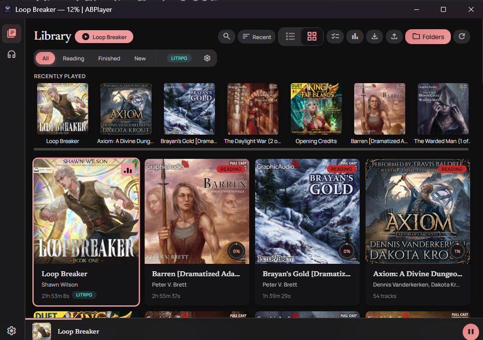
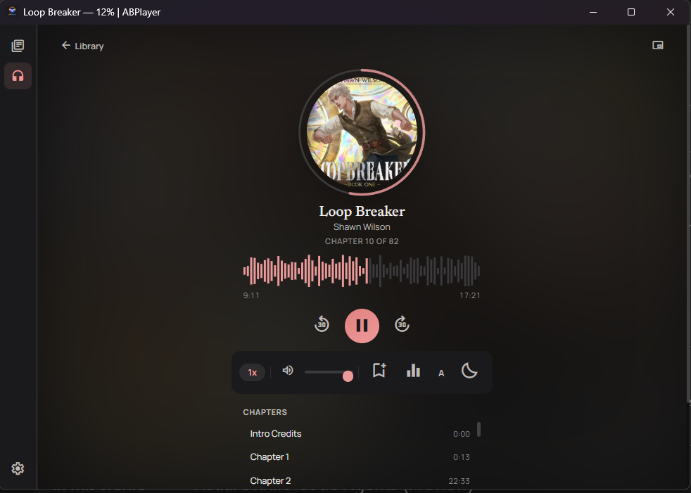
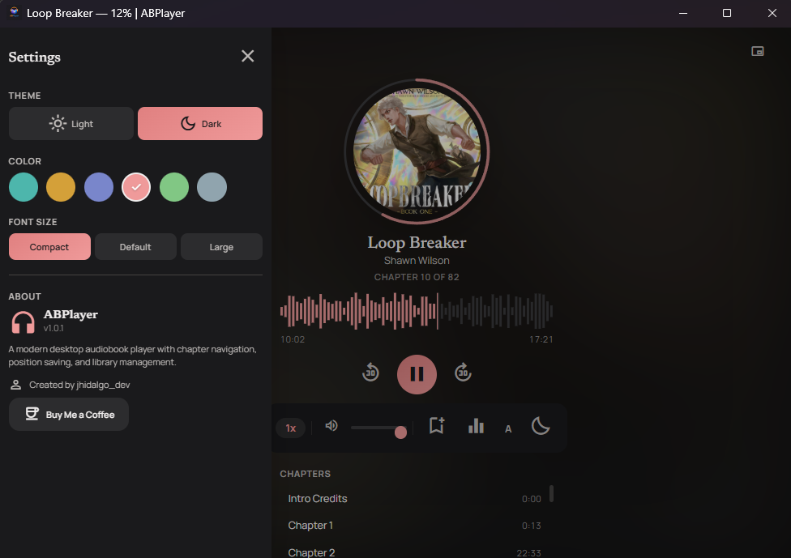
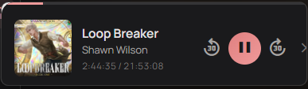

# ABPlayer

[](https://buymeacoffee.com/jhidalgo_dev)

A desktop audiobook player built with [Tauri v2](https://v2.tauri.app/) and [Svelte 5](https://svelte.dev/). Lightweight, fast, and fully offline.

<p align="center">
  
</p>

## Features

- **Three-tab layout** — Library, Player, and Tiers. Narrow icon sidebar, dynamic `rem` scaling across the entire UI.
- **Playback** — MP3, M4A, M4B, MP4, OGG, FLAC, WAV. Chapter navigation, speed control (0.75x-3x), resume prompts, chapter-scoped seeking for M4B. Large M4B files with the `moov` atom at end-of-file (common with Audible / `ffmpeg` without `+faststart`) start within ~10 seconds of pressing play, and a loading spinner is shown on the play button until audio actually begins.
- **Scroll-morphing player** — horizontal hero with cover, title, waveform, transport, and a full utility bar (speed / volume slider / bookmark / EQ / A-B / sleep). Hero collapses to a pinned 56 px strip when the tab body scrolls past 8 px; utility controls remain accessible via a compact ⋮ popover. Tabs: Chapters / Details / Rating.
- **Library** — Folder scanning, metadata extraction, cover art on disk, search, sort/filter by status, genre, series, collections, and tier.
- **Tier ranking** — Multi-list tier system. Create as many tier lists as you want ("Fantasy all-time", "2025 reads", etc.), each with its own rows, colors, and scope. Drag covers between tiers. Books can be ranked in multiple lists with different tiers.
- **Metadata-only ("fileless") books** — Log books you listened to elsewhere (Audible, library, physical) without needing the audio file. Source-aware playback fallback opens Audible or WorldCat search.
- **Per-book ranking card** — Tier picker, editable per-axis sliders, personal notes, favorite quotes.
- **Audio processing** — 3-band equalizer, per-book volume gain, Web Audio API signal chain with smooth `setTargetAtTime` transitions.
- **Organization** — Bookmarks, collections with color tags, series grouping, batch operations.
- **Extras** — Sleep timer, A-B repeat, waveform seekbar, listening statistics, mini-player window, 6 color themes, light/dark mode, font family presets (Editorial / Modern).
- **Keyboard shortcuts** — Space (play/pause), arrows (skip/volume), M (mute), Ctrl+F (search), Ctrl+Shift+P (global play/pause), Ctrl+Shift+M (open mini-player).

## Screenshots

<p align="center">
  
</p>
<p align="center"><em>Library — browse, search, and organize your audiobooks</em></p>

<p align="center">
  
</p>
<p align="center"><em>Player — scroll-morphing hero, tabbed chapters/details/rating</em></p>

<p align="center">
  
</p>
<p align="center"><em>Settings — themes, library folders, and preferences</em></p>

<p align="center">
  
</p>
<p align="center"><em>Mini Player — compact always-on-top window</em></p>

## Downloads

See the [Releases](../../releases) page for:
- **Portable** — Single `.exe`, no installation required.
- **Installer** — Windows NSIS installer.

> **Note:** Windows Defender SmartScreen may show a warning because the app is not yet code-signed. This is normal for indie software. Click **"More info"** then **"Run anyway"** to proceed. The app is fully open-source — you can inspect the code or build it yourself.

---

## Architecture

### Overview

ABPlayer is a Tauri v2 desktop application with a Svelte 5 frontend and a Rust backend. All data stays local — no network calls, no accounts, no telemetry.

```
┌──────────────────────────────────────────────────────┐
│  Svelte 5 Frontend (WebView)                         │
│                                                      │
│  ┌─────────┐  ┌──────────┐  ┌────────┐  ┌────────┐  │
│  │ Library  │  │ Player   │  │ Tiers  │  │ Mini   │  │
│  │  View    │  │  View    │  │  View  │  │ Player │  │
│  └────┬─────┘  └────┬─────┘  └───┬────┘  └────┬───┘  │
│       │              │             │            │     │
│  ┌────┴──────────────┴─────────────┴────────────┴──┐ │
│  │           Svelte Stores (reactive state)         │ │
│  │  audioStore · libraryStore · positionStore      │ │
│  │  userdataStore · bookmarkStore · statisticsStore │ │
│  │  tierListStore · sleepTimerStore · toastStore    │ │
│  └────────────────────┬─────────────────────────────┘ │
│                       │                              │
│          ┌────────────┴──────────────┐               │
│          │ @tauri-apps/plugin-store  │               │
│          │  (JSON key-value on disk) │               │
│          └────────────┬──────────────┘               │
├───────────────────────┼──────────────────────────────┤
│  Rust Backend         │                              │
│                       │                              │
│  ┌────────────────────┴────────────────────────────┐ │
│  │  Tauri Commands (IPC)                           │ │
│  │  read_audio_meta · audiostream:// protocol      │ │
│  └─────────────────────────────────────────────────┘ │
└──────────────────────────────────────────────────────┘
```

### Audio Pipeline

Audio playback uses a custom `audiostream://` protocol registered in Rust, which serves local audio files with proper CORS headers. This is necessary because the Web Audio API's `createMediaElementSource` requires CORS-compliant responses — the default Tauri asset protocol does not provide these.

```
audiostream://localhost/{encoded-file-path}
    │
    ▼
Rust handler (asynchronous, runs off the WebView2 main thread)
    ├── URL-decodes the file path (percent-encoding crate)
    ├── Canonicalizes the path (prevents directory traversal)
    ├── Reads the file with Range request support (HTTP 206)
    ├── Open-ended ranges serve up to 16 MB per response
    │   (so M4B files with the moov atom at EOF reach playback
    │   in a handful of round-trips instead of dozens)
    ├── Wraps the handler in catch_unwind so a panic can't leave
    │   the WebView2 request hanging
    ├── Sets CORS headers (Access-Control-Allow-Origin: *)
    ├── Sets Content-Type based on file extension
    └── Returns audio bytes with Cache-Control: immutable
```

On the frontend, the signal chain is:

```
HTMLAudioElement (src = audiostream://...)
    │
    ▼
MediaElementAudioSourceNode
    │
    ▼
BiquadFilterNode (lowshelf, 250 Hz)   ← Bass EQ
    │
    ▼
BiquadFilterNode (peaking, 1000 Hz)   ← Mid EQ
    │
    ▼
BiquadFilterNode (highshelf, 4000 Hz) ← Treble EQ
    │
    ▼
GainNode (per-book volume, -12 to +12 dB)
    │
    ▼
AudioContext.destination
```

All EQ parameter changes use `setTargetAtTime` for smooth transitions that prevent audio pops.

### Metadata & Chapter Extraction

Metadata is extracted through a layered approach:

**Primary — Rust `lofty` crate** (via Tauri IPC command `read_audio_meta`):
- Reads the file directly from disk (no WebView memory overhead).
- Extracts: title, artist, album, duration, cover art (as base64 data URL).
- Handles MP3 (ID3v2), M4A/M4B/MP4 (iTunes atoms), OGG (Vorbis comments), FLAC, WAV.

**MP4/M4B Chapter Extraction** (custom Rust parser):
- Parses the MP4 `moov` atom tree manually (lofty doesn't expose chapters).
- **QuickTime chapter tracks** (`tref` → `chap` reference → chapter text track) — resolves per-sample file offsets via the full `stsc` / `stco` / `co64` / `stsz` / `stts` tables, so files with many samples packed into a single chunk are handled correctly.
- **Nero `chpl` fallback** (`udta` → `chpl`) with a sanity gate that rejects results where timestamps exceed file duration by more than 20% (protects against stub atoms written by some re-muxers).
- Text samples decoded with UTF-8 / UTF-16 BE / UTF-16 LE / Latin-1 detection.
- All allocations capped at 16 MB to prevent OOM from malformed files.

**Title fallback**: some encoders (Audible, iTunes) write the first chapter's name into the file's title atom. If the parsed title matches the first extracted chapter, the display title falls back to `album`.

**Fallback — JS `music-metadata`** (frontend, first 2 MB): used when Rust extraction returns no chapters. Parses ID3v2 `CHAP` frames (common in MP3 audiobooks).

### Library Indexing

The library is a list of `BookMeta` objects stored in `library.json` via Tauri's plugin-store.

**Scanning flow:**

1. User adds a folder → `readDir` recursively finds audio files.
2. **Grouping** — Files in the same directory are grouped into a single multi-track book. Standalone formats (`.m4b`) are always treated as single-file books.
3. **Phase 1 (instant)** — Books are created with just file paths and folder-derived titles. The library renders immediately with placeholder data.
4. **Phase 2 (background enrichment)** — For each book, `extractMetadata` is called on the first track. Title, author, album, cover art, and duration are populated. Updates are batched (5 books per store update) to minimize reactive re-renders. Metadata-only (fileless) books are preserved across scans and skipped by the enrichment loop.
5. **Cover migration** — Base64 cover art is saved to `$APPDATA/covers/` as JPEG files. The library store is updated with asset-protocol URLs. This runs once; subsequent loads skip migration.
6. **Persistence** — The enriched library (with asset URLs, not base64) is saved to `library.json`.

**File watching**: After the initial scan, a recursive file watcher monitors all library folders. New or changed files trigger a debounced rescan (2-second delay after the last change event).

### Metadata-Only ("Fileless") Books

Books without a local audio file are stored as normal `BookMeta` entries with `fileless: true` and a sentinel `filePath = "fileless:<id>"`. This keeps every existing `filePath`-keyed store (userdata, positions, bookmarks, tier assignments) working unchanged. The player short-circuits playback for fileless books and — when the book is marked with an Audible or Library source — offers an "Open in {source}" button via `plugin-shell` that opens a search URL in the user's default browser.

### Tier Lists

Tier lists live in their own store (`tierlists.json`). Each list owns its own tiers, colors, default axes, and `assignments: Record<filePath, tierId>`. A book can be ranked in many lists with different tiers. One list is flagged as the **default** — it powers the tier badge on library covers and the "Your rating" card on the player detail. HTML5 drag-and-drop moves covers between tier rows and an unranked pool.

### Position & State Persistence

All app state is persisted via `@tauri-apps/plugin-store`, which writes JSON files to the OS app data directory (`%APPDATA%/com.abplayer.app/` on Windows).

| Store file | Contents |
|---|---|
| `library.json` | Book metadata, folder list, last scan timestamp |
| `positions.json` | Per-book playback position, track index, duration, last played timestamp |
| `bookmarks.json` | Named position markers per book |
| `statistics.json` | Listening time per day, books finished count, streaks |
| `userdata.json` | Per-book overrides (title, author, cover, genre, series, status, narrator, description, notes, quotes, tags, axes), collections, user preferences |
| `tierlists.json` | Tier list definitions and per-book tier assignments |

**Position saving** follows a belt-and-suspenders approach:
- Auto-save every 10 seconds during playback via `setInterval`.
- Immediate save on pause.
- Save on window close via Tauri's `onCloseRequested` event.

**Resume logic**: When opening a book, if a saved position exists and is past 10 seconds, a resume prompt is shown.

### Security Model

- **Content Security Policy** — Restrictive CSP blocks `unsafe-eval`, `object` embeds, and unauthorized origins. Only `self`, Google Fonts, and the custom protocols (`audiostream://`, `asset://`) are allowed.
- **Per-window capabilities** — The main window has full Tauri permissions. The mini-player window only has event emission and window management (no filesystem, dialog, or store access).
- **Path traversal prevention** — The audiostream protocol handler canonicalizes all file paths before serving, preventing `../` directory traversal attacks. Access is gated by canonicalization rather than CORS — the protocol is only reachable from the app's own WebView.
- **Panic isolation** — The async audiostream handler wraps work in `catch_unwind` so a parse panic on a malformed Range header can't leave a WebView2 request hanging.
- **Allocation limits** — MP4 chapter parsing caps all allocations at 16 MB and sample expansion at 100K entries per `stts` entry.
- **Error sanitization** — Rust errors return generic messages to the frontend; full paths are only logged server-side.
- **Import validation** — Library import validates JSON structure, schema version, entry types, and collection references before processing.

### Project Structure

```
src/                              # Svelte 5 frontend
  App.svelte                      # Root layout: sidebar + Library / Player / Tiers
  MiniPlayer.svelte               # Separate mini-player window
  lib/
    components/                   # UI components
      Library.svelte              # Grid/list of books, drag-drop, context menu
      PlayerView.svelte           # Scroll-morphing player with tabs + more menu
      TiersView.svelte            # Multi-list tier board
      BookCard.svelte             # Book tile with tier badge + LOGGED pill
      BookEditDialog.svelte       # Edit / create (metadata-only) dialog
      BookRankingCard.svelte      # Tier picker + per-axis sliders
      EditableTierRow.svelte      # Drag-and-drop tier row
      UnrankedPool.svelte         # Drop zone for unranked books
      NewTierListDialog.svelte    # Create-list modal
      AxisEditor.svelte           # Per-axis label + slider
      TierBadge.svelte            # Circle badge with tier letter
      TierColorPicker.svelte      # Palette + custom hex
      TierListSidebar.svelte      # Tier list navigator
      SettingsPanel.svelte        # Theme, color, font scale, font family
      MiniCover.svelte            # Small draggable book thumb
      (plus Player, Toolbar, Modal, Toast, Stats, etc.)
    stores/                       # Reactive stores
      audioStore.ts               # Playback, Web Audio API, track management
      libraryStore.ts             # Book scanning, indexing, fileless books
      positionStore.ts            # Position save/load, auto-save, resume
      userdataStore.ts            # User overrides, collections, preferences
      bookmarkStore.ts            # Named position markers
      statisticsStore.ts          # Listening time tracking
      sleepTimerStore.ts          # Sleep timer logic
      tierListStore.ts            # Tier lists, assignments, default-list helpers
      toastStore.ts               # Toast notifications
      storeUtils.ts               # Shared plugin-store cache
    utils/
      metadata.ts                 # Metadata extraction (Rust IPC + JS fallback)
      coverStorage.ts             # Base64 → disk migration, asset URL resolution
      format.ts                   # Time formatting, progress calculation
      sort.ts                     # Natural sort, library sort/filter
      id.ts                       # Simple unique ID generator
      focusOnMount.ts             # Svelte action: focus on mount (a11y)
    types.ts                      # TypeScript type definitions
    themes.ts                     # 6 color theme presets
    tierDefaults.ts               # Default tier palette + templates
src-tauri/                        # Rust backend
  src/lib.rs                      # Tauri commands, audiostream protocol, MP4 parser
  capabilities/
    main.json                     # Full permissions (main window)
    mini-player.json              # Minimal permissions (mini-player)
  tauri.conf.json                 # App config, CSP, bundle settings
```

## Building from Source

### Prerequisites

- [Node.js](https://nodejs.org/) 18+
- [Rust](https://www.rust-lang.org/tools/install) (stable)
- [Tauri v2 prerequisites](https://v2.tauri.app/start/prerequisites/)

### Development

```bash
npm install
npm run tauri dev
```

### Production Build

```bash
npm run tauri build
```

Outputs:
- `src-tauri/target/release/abplayer.exe` (portable)
- `src-tauri/target/release/bundle/nsis/ABPlayer_*_x64-setup.exe` (installer)

## Support

Created by **jhidalgo_dev**

[](https://buymeacoffee.com/jhidalgo_dev)

---

All rights reserved. This source code is provided for viewing purposes. See the [Releases](../../releases) page for download links.
